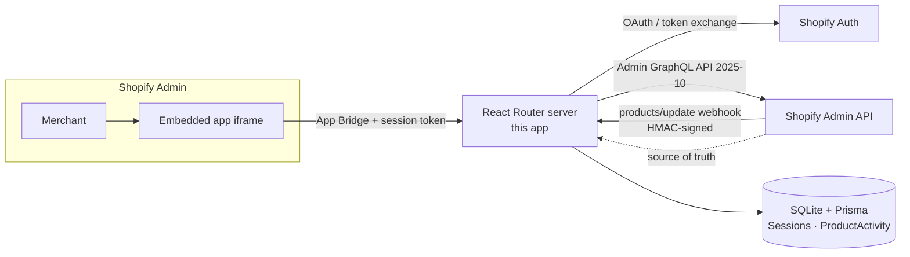

# Product Manager — Embedded Shopify App

> An embedded Shopify admin app that lets merchants **view, search, filter, and edit their products** without leaving Shopify admin — with every change and every `products/update` webhook recorded in an audit log.


**Candidate:** Mahnoor Gulzar &nbsp;·&nbsp; **App:** Mahnoor Gulzar (Product Manager) &nbsp;·&nbsp; **Dev store:** `mahnoor-qp57fe2j.myshopify.com`

---

## 🔗 Live links

| Resource | Link |
|---|---|
| 🟢 **Live app URL** (dev tunnel — reachable while the demo session is running) | https://duty-tournament-gulf-speak.trycloudflare.com |
| 🛍️ **Open the app inside Shopify admin** | https://admin.shopify.com/store/mahnoor-qp57fe2j/apps/c36948ab48ffccf6527d512b20a2753b |
| 🏪 **Development store admin** | https://admin.shopify.com/store/mahnoor-qp57fe2j |
| ⚙️ **App in Dev Dashboard** | https://dev.shopify.com/dashboard/236161031/apps/425462235137 |
| 📦 **Source code** | This repository — see [project structure](#-project-structure) |

> The live URL is a Cloudflare quick-tunnel used for the demo session. For a permanent URL, the app can be deployed to any Node.js host (see [Dockerfile](./Dockerfile)).

---

## ✨ What the app does

| Feature | Details | Source |
|---|---|---|
| **Shopify authentication** | Installable embedded app. OAuth/token-exchange handled by `@shopify/shopify-app-react-router`; sessions persisted in SQLite. No token ever reaches the browser. | [`app/shopify.server.ts`](./app/shopify.server.ts), [`app/routes/auth.$.tsx`](./app/routes/auth.$.tsx) |
| **Product dashboard** | Real product data — image, title, SKU, price (+ currency), total inventory, status badge. Cursor pagination, title/SKU search, status filter, loading & empty states. | [`app/routes/app._index.tsx`](./app/routes/app._index.tsx) |
| **Product details** | Description (rendered HTML), image gallery, all variants with SKU/price/inventory, status, type, vendor. Friendly handling of invalid/deleted product IDs. | [`app/routes/app.products.$id.tsx`](./app/routes/app.products.$id.tsx) |
| **Edit product** | Title, description, status, product type, vendor — persisted to Shopify via the `productUpdate` Admin GraphQL mutation (not just local state). | [`app/routes/app.products.$id_.edit.tsx`](./app/routes/app.products.$id_.edit.tsx) |
| **Activity log (app DB)** | Every edit made in-app is logged with **old → new values**; every webhook is logged too. Viewable on the *Activity log* page. | [`prisma/schema.prisma`](./prisma/schema.prisma), [`app/routes/app.activity.tsx`](./app/routes/app.activity.tsx) |
| **`products/update` webhook** | HMAC-verified receiver that records the event in the app DB and returns 500 on failure so Shopify retries. | [`app/routes/webhooks.products.update.tsx`](./app/routes/webhooks.products.update.tsx) |
| **Error handling & validation** | API/network failures, auth/session errors, invalid product IDs, empty results, `userErrors` from mutations, invalid form input, bad webhook signatures — all handled gracefully. | every route's loader/action + `s-banner` UI |

---

## 🏗️ Architecture



**Design decisions**

- **Shopify's recommended stack** — React Router 7 embedded app (per the [official template](https://github.com/Shopify/shopify-app-template-react-router)), Polaris web components, App Bridge, Admin **GraphQL** API `2025-10` with typed documents generated by [`graphql-codegen`](./.graphqlrc.ts).
- **Server-side only API access** — all Admin API calls run in loaders/actions using the merchant session's access token; secrets stay in `SHOPIFY_*` env vars on the server.
- **Shopify = source of truth** — the app DB stores *only* app-specific data (`ProductActivity`) and OAuth sessions. Product data is always read/written live.
- **SQLite + Prisma** — zero-dependency DB, trivially swappable to Postgres/MySQL via the `datasource` block; migrations in [`prisma/migrations`](./prisma/migrations).
- **Edit-then-audit** — the edit action re-reads the product from Shopify first, so the `ProductActivity` row records an accurate field-level old → new diff of *what actually changed*.

---

## 🗄️ Data model

```prisma
model ProductActivity {
  id        String   @id @default(cuid())
  shop      String
  productId String
  action    String     // "product.update" (app) | "products/update" (webhook)
  source    String     // "app" | "webhook"
  oldValue  String?    // JSON of changed fields, before
  newValue  String?    // JSON of changed fields, after
  createdAt DateTime @default(now())
}
```

---

## 🚀 Getting started

**Prerequisites:** Node `>=22.12`, [Shopify CLI](https://shopify.dev/docs/api/shopify-cli), a [Partner account](https://www.shopify.com/partners) + development store with products (dummy CSVs [here](https://github.com/shopifypartners/shopify-product-csvs-and-images/tree/master/csv-files)).

```bash
npm install            # dependencies
cp .env.example .env   # env template — CLI fills real values on dev
npm run dev            # = shopify app dev → links app, tunnel, installs
```

On first run the CLI links the project to an app in the Dev Dashboard (writes `client_id` into [`shopify.app.toml`](./shopify.app.toml)), starts a dev proxy, and prints the install/preview URL — open it, pick the dev store, approve the `write_products` scope.

**Production-style run** (how the live demo above is served):

```bash
npm run setup          # prisma generate + migrate deploy
npm run build
npm start              # react-router-serve on :3000
```

## 🪝 Webhook testing

`products/update` is subscribed in [`shopify.app.toml`](./shopify.app.toml) and received by [`webhooks.products.update.tsx`](./app/routes/webhooks.products.update.tsx). `authenticate.webhook()` verifies `X-Shopify-Hmac-Sha256` — forged requests get 401.

End-to-end check:

1. Serve the app on a public URL (tunnel/host).
2. In Shopify admin, edit any product → save.
3. **Activity log** in the app shows a `products/update` row with `source = webhook`.
4. CLI alternative: `npx shopify app webhook trigger --topic products/update --address <app-url>/webhooks/products/update`.

## 📂 Project structure

```
app/
├─ shopify.server.ts                 shopifyApp() — auth, sessions, API version
├─ db.server.ts                      Prisma client singleton
├─ product-activity.server.ts        recordProductActivity() helper
└─ routes/
   ├─ app.tsx                        embedded shell + nav (Products · Activity log)
   ├─ app._index.tsx                 product dashboard
   ├─ app.products.$id.tsx           product details
   ├─ app.products.$id_.edit.tsx     edit form → productUpdate mutation
   ├─ app.activity.tsx               audit-log viewer
   ├─ auth.$.tsx / auth.login/       OAuth + shop login
   └─ webhooks.*.tsx                 products/update, uninstalled, scopes_update
prisma/                              schema + migrations
shopify.app.toml                     scopes, webhooks, app config
```

## 🧰 Commands

| Command | Purpose |
|---|---|
| `npm run dev` | Shopify dev server + tunnel |
| `npm run build` / `npm start` | production build / serve |
| `npm run typecheck` / `lint` | `tsc --noEmit` / ESLint |
| `npm run graphql-codegen` | regenerate typed GraphQL docs |
| `npx prisma studio` | browse the DB |

---

<sub>Built by **Mahnoor Gulzar** — MERN developer — as the Shopify Application Developer technical assessment.</sub>
